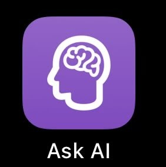

# LLM Shortcut - iOS Shortcut (Ask AI)

### Run LLMs on desktop computer / remotely and access them from your iOS device



## Overview

This guide details how to use an iOS Shortcut to interact with large language models (LLMs) hosted on a local desktop
computer through a FastAPI endpoint. The setup allows you to send prompts from your iOS device and receive responses
from the LLM, enabling on-the-go access to advanced language models. There are 2 main components to this setup:

- **FastAPI Application**: A FastAPI application that serves as an endpoint for the iOS Shortcut to send requests to.
- **iOS Shortcut**: A shortcut that sends prompts to the FastAPI application and displays the response.

## Why use LLM Shortcut?

- Less battery drain - sending web requests is much less battery intensive than running inference on-device
- Faster inference with remote models
- More flexibility - run models accessible via [LLM](https://llm.datasette.io/en/stable/index.html) library
- AnyScale compatible

## Which models are available?
   - Current AnyScale model names include (1/3/24)
        - `meta-llama/Llama-2-7b-chat-hf`
        - `meta-llama/Llama-2-13b-chat-hf`
        - `meta-llama/Llama-2-70b-chat-hf`
        - `codellama/CodeLlama-34b-Instruct-hf`
        - ` mistralai/Mistral-7B-Instruct-v0.1`
        - `mistralai/Mixtral-8x7B-Instruct-v0.1`
        - `Open-Orca/Mistral-7B-OpenOrca`
        - `HuggingFaceH4/zephyr-7b-beta`


   - All GGUF models are available through local inference via llama.cpp
      - [The Bloke](https://huggingface.co/TheBloke) regularly publishes many GGUF models

## Prerequisites

- [ngrok](https://dashboard.ngrok.com/get-started/your-authtoken) AuthToken
- [AnyScale](https://app.endpoints.anyscale.com/console/credentials) API key
- [Docker](https://www.docker.com/products/docker-desktop/)
- iOS / [Shortcuts app](https://apps.apple.com/us/app/shortcuts/id915249334)

## Setup Instructions

### Server (Desktop) Setup

1. **Git Clone**:
    - Clone this repository to your local machine:
      ```bash
      git clone https://github.com/00brad/LLM-Shortcut.git
      ```

2. **Build Docker Image**:
    - Create a `.env` file in the project root with your [ngrok](https://dashboard.ngrok.com/get-started/your-authtoken)
      AuthToken and [AnyScale](https://app.endpoints.anyscale.com/console/credentials) API Key (Model can be set to an AnyScale model name or a local GGUF model name):

      ```
      NGROK_AUTHTOKEN=your_ngrok_authtoken
      ANYSCALE_ENDPOINTS_KEY=your_anyscale_key
      MODEL=your_model_name
      MAX_TOKENS=your_max_tokens
      ```

    - Build the Docker image:
      ```bash
        docker build -t llm_shortcut .
        ```

3. If using local GGUF model (optional), download the into project root:
    - Example:
      ```bash
        wget https://huggingface.co/TheBloke/Llama-2-7b-Chat-GGUF/resolve/main/llama-2-7b-chat.Q6_K.gguf
        ```
    - Set the model name in the `.env` file to the name of the downloaded model.

3. **Run the FastAPI Application**:
    - Start the FastAPI server using Uvicorn:
      ```bash
         docker run llm_shortcut
      ```
    - Upon startup, `ngrok` generates a public URL that tunnels to your local desktop computer.
    - The generated ngrok URL, which is your endpoint, will be displayed in the console after running:
      <div align="left">
        
      </div>
### iOS Shortcut Setup

1. **Shortcut Setup**:
    - Click the following link to open
      the [LLM Shortcut](https://github.com/00brad/LLM-Shortcut/raw/main/Ask%20AI.shortcut) in the Shortcuts app.
    - Click the '+ Add to Shortcut' button to add the shortcut to your library.
      <div align="left">
        
      </div>
    - Click the '...' button to edit the shortcut.
      <div align="left">
        
      </div>
    - Change the url in the first line to the ngrok URL generated in the previous section.
      <div align="left">
        
      </div>
    - Click the 'Done' button to save the changes.
    - Click the 'i' button to view the shortcut details and click Add to Home Screen to add the shortcut to your home
   


2. **Using the Shortcut**:
    - Click the shortcut and speak your prompt or say ***"Hey Siri, Ask AI"*** to activate the shortcut.
         <div align="left">
        
      </div>
    - The prompt is sent to the FastAPI server, processed by the LLM, and a response is returned to your device.

## Additional Notes

- The ngrok URL will change each time the FastAPI server restarts.
- You can run in detached mode by adding the `-d` flag to the `docker run` command. (Use docker logs to view the ngrok URL)
- Ensure the `.env` file is correctly set up with your AnyScale API key, ngrok AuthToken, and model name.
- Currently, the server is configured to use an AnyScale models.
- No auth currently enabled, will be adding keys soon

This setup allows you to leverage the power of language models directly from your iOS device, making it
fast and convenient to use advanced AI capabilities wherever you go.

## TODO:

- Add auth
